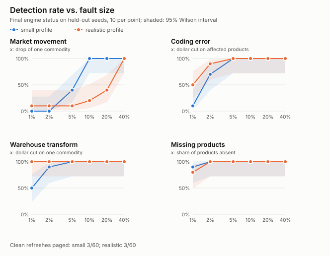

# Case study: making a QC engine earn its alarms

Verity checks weekly refreshes of retail sales tables (store × product × week)
and decides whether a refresh is fine, explainable, or needs an analyst. This
is the story of taking it from a large codebase that alarmed on everything to
a smaller one whose claims are measured, including where it still fails.
Everything here is measured on a synthetic generator with a known fault
oracle; nothing is a claim about real data.

## 1. Where it started

The project had grown to ~28k lines with a deterministic engine, learned
decision models, LLM-agent plumbing, a remote decision service, a
statistical "clearance" mechanism, and a pipeline for collecting analyst
labels. Hundreds of tests passed and lint and type checks were clean. A review
that ran the system end to end, rather than its parts, found:

- **It alarmed on everything.** Every scenario in a fresh synthetic suite that
  was not a schema failure came back INVESTIGATE, including the benign ones. The project's own replay of 27
  real refreshes from a public dataset alarmed on 25.
- **There was no clean control.** The generator's only "control" injected a
  genuine 20% category drop and expected INVESTIGATE, so no false-positive
  rate had ever been measured on a clean refresh.
- **A flattering metric.** Shadow scoring reported a false-positive rate of
  0.0 while the latest-week control rate was 1.0: detection used the final
  status, false positives used an intermediate one.
- **A safety mechanism that could never fire.** A temporal finding failed only
  when its residual was *at least* the materiality, and a clearance
  certificate required the same residual to be *at most* that materiality.
  With a deliberately permissive qualification, 0 of 46 findings cleared.
  Thousands of lines guarded an unreachable path.
- **A detector wired to nothing.** The opt-in distribution-drift check set a
  status that the policy step then overwrote; enabling it changed nothing. Its
  "pre-registered PASS" came from a benchmark that called the scoring function
  directly and never ran the engine.
- **Operational bugs**: "suppressed" notifications were still sent, large
  alerts were dropped instead of shrunk, webhook tokens could go over plain
  HTTP or follow redirects, an early failure in the weekly runner was masked
  by an `UnboundLocalError`, and a production Parquet source was labelled
  "synthetic", which would have let synthetic artifacts authorize real data.

Every one of these had passing unit tests. The tests checked components in
isolation; nothing checked what the system as a whole returned.

## 2. Measure first: a real negative control

The first change was to the evaluation, not the engine: a `clean` family (a
refresh with no injection at all) became the only control, and the
genuine-movement family moved to the detection side. Re-scoring the registered
cohort plan through the full engine gave the honest baseline: **10 of 10 clean
refreshes alarmed.**

## 3. Fix the detectors, not the threshold

Diagnosis on clean refreshes pointed at specific mechanisms:

| Cause of false alarms | Fix |
|---|---|
| A "coordinated residual" check summed every same-sign leaf residual, a sign-selected sum with no significance test | Removed; genuinely coordinated movement shows up in the parent series |
| Robust, seasonal and EWMA z-scores decided anomalies while ignoring trend, seasonality and multiplicity | Kept as evidence only |
| Leaf series were forecast on their level, which carries the common market swing (~6% a week here) | Leaves are tested on their *share of the parent*, which moves ~2% a week; a market-wide swing is not a leaf anomaly |
| Each measure was its own multiple-testing family | One Benjamini-Hochberg family per refresh, so the chance of any false page per clean refresh is about `q` |
| Price outliers in old weeks were re-flagged on every refresh | Only appended periods are tested |
| One missing entity out of thousands escalated | An absence escalates only when the missing entities were expected to carry a material share of the period |

`q` was chosen on scenarios disjoint from the cohort (0.01: 2/40 clean false
alarms versus 3/40 at 0.05, with no detection lost). The final status is now
computed in exactly one place, from findings, so a check cannot set a status
that something else silently overwrites.

**Registered cohort, held-out seeds: detection 72/72 (Wilson lower bound
0.949), clean false positives 0/60 (upper bound 0.060). Gate passed.** The
drift detector, now actually wired in, failed the same gate (25/60 clean
refreshes alarmed) and stays off.

## 4. Delete what has not earned its place

With a working measurement in hand, the rest was judged by it. The learned
decision layer had 0% held-out cause accuracy on synthetic labels and depended
on analyst labels that would never exist; the agent and remote-provider
plumbing had never been evaluated; clearance could not succeed. They were
deleted along with the real-data and analyst machinery and the research
adapters: **~28k → ~15k lines, 20+ commands → 11, the test suite from ~110 s
to ~30 s.** The rule-based cause labeller that remained was scored for the
first time: 0.833 cause accuracy on held-out cases, with every miss in two
whole families. That is the baseline any model now has to beat.

## 5. Make the benchmark harder, and let it find the next flaws

72/72 with 0/60 false alarms suggested the benchmark was too easy. Two things
were added:

- **A `realistic` generator profile**: per-category seasonality, market
  shocks, category noise, intermittently selling products, and late-arriving
  transactions that restate the last two weeks of every refresh.
- **`qc sweep`**: detection against fault size (1%-40%, the same seeded worlds
  at every size), two-fault refreshes, and clean false alarms per profile.

It found two real engine flaws:

1. **Seasonality defeated the share test.** A category whose share swings
   through the year sits far from its trailing mean; a 20% drop was caught
   2/10 times.
2. **Late-arriving data broke root-cause labelling.** Restated weeks diverge
   at the source, so "first stage that diverged" was always the source, and
   every coding or warehouse error was labelled source ingestion: **0/54 and
   0/60 correct.**

The fixes were developed on separate seeds: lineage now blames the stage that
*adds* the largest revision over its upstream stage, and each category's share
is tested against the better of a trailing baseline and a year-over-year one,
chosen on its own history.

<picture>
  <source media="(prefers-color-scheme: dark)" srcset="img/detection-curves-dark.svg">
  
</picture>

| `realistic` profile | Before | After | After, unseen seeds |
|---|---|---|---|
| Coding / warehouse errors labelled correctly | 0/54, 0/60 | 54/54, 60/60 | 55/55, 59/59 |
| 20% single-category drop detected | 2/10 | 4/10 | 8/10 |
| 40% single-category drop detected | 6/10 | 10/10 | 10/10 |
| Clean refreshes that alarmed | 3/60 | 3/60 | 4/60 |

The registered cohort gate still passes after both fixes.

A third gap came from reading the numbers rather than the curves: revision
materiality is measured against the *whole* history, so a restatement confined
to one week had to exceed about 10% of that week before anything escalated.
Each overlap week is now also judged on its own, net of what its structural
events explain, with a looser tolerance for a declared late-arrival window.
A new `week_restatement` family shows the effect: one week restated by
anything from 1% to 40% is detected 60/60 on both profiles. The cost is
explicit: a feed with late-arriving data must declare its window, because
undeclared, the realistic profile alarms on every clean refresh (60/60).

## 6. Then try a model, against the baseline

With the rules fixed (a source-stage historical change is now labelled a
historical correction, which lifted cohort cause accuracy from 0.833 to
0.917), a learned labeller had a fair baseline to beat. One gradient-boosted
classifier per cause was trained on 760 generated refreshes, using only
the engine's own output as features, and scored once on 380 refreshes from
unseen seeds:

- It names both causes of a two-fault refresh 70/80 times; the rules, which
  gave one label, managed 7/80.
- On single faults it was only modestly better (0.93 vs 0.89, p = 0.013),
  almost entirely on small coding errors and market movements the rules
  decline to label.
- Trained on the `small` profile and tested on `realistic`, it fell to
  0.75, well below the rules' 0.88.

Its gains showed where the rules were weak, so the rules changed instead.
They now name every supported cause, with care not to count one fault twice
(a store outage also removes the products sold only there; a remap can empty
a category), and name a coding or warehouse stage that lineage localizes even
below materiality. They now match the model on single faults (0.91 vs 0.93,
not significant), name both causes of 51/80 pairs, and still transfer across
profiles. The model stays in a sandbox
([labeller-experiment.md](labeller-experiment.md)).

A general decision model was tried last: Decision-2.0-Lux-9B, quantized to
4 bits to fit a 16 GB consumer GPU after checking it against the unmodified
model (297/300 answers unchanged). It was never trained on the generator, and
it ranked eight of ten causes almost as well as the trees. But it could not
tell normal late-arriving data from a restatement, or a market move from a
fault, and it named three causes per refresh. That left it right on 5 of 260
single faults (98 with tuned thresholds). Its predicted failures were
registered before the run, and they held.

## 7. What it still cannot do

- Category drops of 10% or less on seasonal data are within noise when ~52
  series are tested per refresh at a 1% false-alarm budget (2/20 detected).
- Late arrival must be declared; within one version pair the engine cannot
  tell it from a restatement fault.
- A market movement is never given a cause, so pairs involving one are named
  only in part.
- Every number above comes from a generator written alongside the engine; the
  realistic profile's settings are plausible guesses, not calibrated to real
  retail data.

## 8. Lessons

- **Test the system's output, not just its parts.** Each defect in section 1
  sat behind passing unit tests.
- **A false-positive rate needs a clean control.** Without one, "0.0" can mean
  "never measured".
- **One place decides the status.** Two status paths let a check exist without
  effect.
- **Gates must be satisfiable and must run the system.** A gate that needs 380
  cases you will never run, or that scores a component instead of the engine,
  certifies nothing.
- **Let the benchmark get harder than the code.** The second round of flaws
  only appeared once the generator stopped flattering the detector.
- **Deleting is a result.** Half the code went because measurement showed it
  did nothing; the remaining half is the part the numbers are about.
